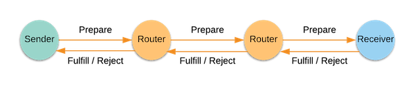
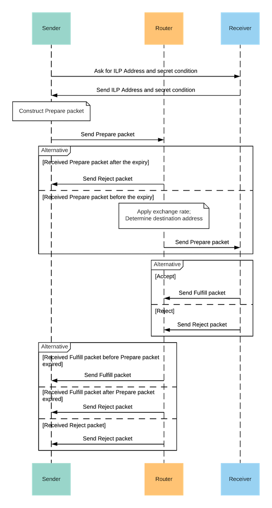

# Basic Interledger Payment Flow

This section outlines the components of an Interledger payment system and explains the steps involved in an Interledger payment.

## Interledger payment

The Interledger payment system consists of four main components:
- Sender - Initiates a value transfer.
- Router - Applies currency exchange and forwards packets of value.
- Receiver - Receives the value.
- ILP Packet - A binary data packet, which contains the information required for an ILP payment. ILPv4 has three packet types: Prepare, Fulfill, and Reject. These packet types roughly correspond to request, response, and error messages.

In the following example scenario, the sender sends a Prepare packet to the connecting router. This router forwards the packet onward, possibly through more connecting routers, until it reaches the receiver. The receiver then accepts or rejects the packet by sending a Fulfill packet or a Reject packet, also through one or more connecting routers.

 

## Interledger payment flow

### Prerequisites

For the Interledger payment flow described here, assume the following:
1. The sender and receiver have accounts with at least one router on the Interledger network.
2. The sender knows the receiver's persistent payment identifier, which is required for exchanging necessary payment information.

### Payment flow

1. The sender initiates a payment by connecting with the receiver over an out-of-band authenticated channel and obtaining the receiver's ILP address and a shared secret.
0. The sender constructs a Prepare packet with the destination ILP address, the shared secret, amount, and expiry.
0. The sender sends the Prepare packet to the router it is connected to.
0. The router checks the expiry of the Prepare packet. If the router receives the packet after the expiry, the router sends a Reject packet to the sender. If the router receives the packet before the expiry, the following steps take place.
0. The router uses its local routing tables and the destination address from the Prepare packet to determine the next hop to which to forward the packet. The next hop can be another router or the receiver.
0. The router determines the outgoing asset type based on the next hop it will forward the packet to and applies its exchange rate and fees to the Prepare amount.
0. The router forwards the Prepare packet to the next hop, which may be another router. All subsequent routers go through steps 4-6 (treating the previous router as the sender) until the packet reaches the receiver.
0. The receiver receives the packet and checks the packet contents. For example, the receiver checks if the amount to be received is acceptable.
0. If the receiver accepts the Prepare packet, the receiver returns a Fulfill packet. If the receiver does not want the Prepare packet, or the Prepare packet does not pass one of the checks, the receiver returns a Reject packet instead.
0. The router checks if the receiver returned a Fulfill packet before the expiry time specified in the Prepare packet. The router also must check that the fulfillment is the preimage to the hash/execution condition, otherwise the Fulfill packet is invalid.
If these conditions are met, the router returns the same Fulfill packet to the previous router. If the receiver returned a Reject packet, or the Prepare expired before the Fulfill packet was returned, the router returns the Reject packet to the preceding router. Each router repeats this step until the Fulfill or Reject packet reaches the sender.
0. The sender repeats the process, starting from step 2, as many times as is necessary to transfer the desired total amount of value.

The following diagram shows the sequence of events that occur during an Interledger payment:

